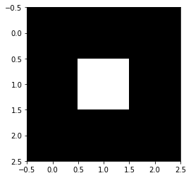

# Image-Filtering

A kernel is a small matrix used to create effects like smoothing and edge detection. Kernels are applied to an image by making each pixel the average of the pixels around it. The weight and amount of pixels used are decided by the kernel. 

Using this identity kernel, the resultant image is the same as the original. 

Using this double box kernel, the smoothed image shows two of the original image. 
